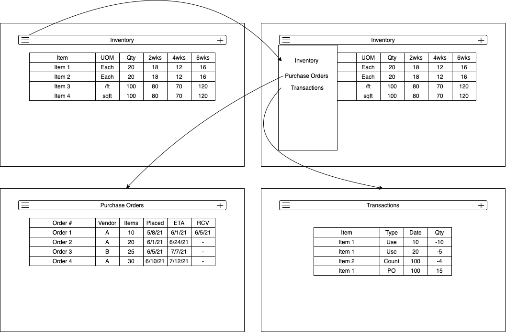
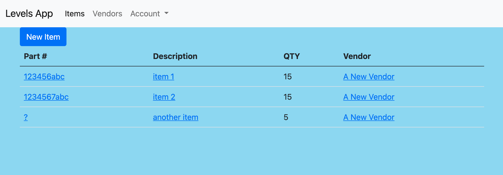

# GAProject2
# Levels App
By Matthew Millheim

[Link to App](https://levelsapp.herokuapp.com/)

---

## Introduction and Description
Levels App is a simple inventory management app where item can be linked to vendors and their quantities can be tracked.

### How to use the App
The initial screen lists all items in the system with their quantites and vendors. The navbar contains links for this item view and the vendor list. Click on an item's name or part number to view the item. There is a button to enter the edit screen for the item in this view. Clicking on the vendor name will bring you to the vendor view screen where you can view the vendor information, see a list of items associated with the vendor, and edit the vendor.

## Design
As part of the of design process I created user stories to frame up what capabilities I would like to add to the app. They are divided into *Minimum Viable Product (MVP)* and *Stretch Goals*.

#### MVP:
Users should be able to create, view, edit and delete items.
Users should be able to create, view, edit and delete vendors.
Users should be able to associate items with vendors

#### Stretch Goals:
Users should be able add transactions to track changes to item quantities.
Users should be able to create purchase orders for ordering more items.
Users should be able to create user accounts and log in 

### Initial Mockup:

### Technologies Used
I used the following technologies to build this app...
- ***HTML and EJS*** for the user interface
- ***Bootstrap*** for styling
- ***Express and Node*** for the middleware
- ***MongoDB*** for the database
- ***Auth0*** for user authentication

### Unsolved Problems and Next Steps

I struggled implementing the user authentication. There are no user profiles or user management built into the app. I would like to improve this. I would like to add transactions and purchase orders, as well as, the ability to create multiple companies and assign users to them.
